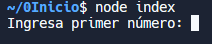
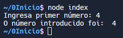

# Antes de comenzar 

## O arquivo 'package.json' 

O arquivo package.json deberá ser modificado, introducindo unha línea para poder executar os programas. Inicialmente dito arquivo ven da seguinte maneira:

```json
{
  "name": "nodejs",
  "version": "1.0.0",
  "description": "",
  "main": "index.js",
  "scripts": {
    "test": "echo \"Error: no test specified\" && exit 1"
  },
  "keywords": [],
  "author": "",
  "license": "ISC",
  "dependencies": {
    "@types/node": "^18.0.6",
    "node-fetch": "^3.2.6"
  }
}

```

deberemos introducir unha línea, escribindo:

```json
"type":"module"
```

quedando así: 

```json
{
  "name": "nodejs",
  "version": "1.0.0",
  "description": "",
  "main": "index.js",
  "scripts": {
    "test": "echo \"Error: no test specified\" && exit 1"
  },
  "keywords": [],
  "author": "",
  "license": "ISC",
  "dependencies": {
    "@types/node": "^18.0.6",
    "node-fetch": "^3.2.6"
  },
  "type":"module"
}


```

## Os programas

> Para poder realizalos exercicios, deberemos insertar as seguintes líneas de código

```javascript
import * as readline from 'node:readline/promises';
import { stdin as input, stdout as output } from 'node:process';

const rl = readline.createInterface({ input, output });
```

Posteriormente, cando queiramos introducir texto deberemos utilizar o seguinte código:

```javascript
const answer = await rl.question('Ingresa un número:  ');

```
Neste caso, estamos a facela pregunta seguinte: 
```
Ingresa un número: 
```

Pra que se escriba o número por consola, podemos utilizar a función 'console.log(' ')', introducindo o seguinte código:

```javascript
console.log('O número introducido foi: ',answer)
```
Para finalizar, deberemos escribir a seguinte sentenza:
```javascript
rl.close();
```
Dita sentenza, pecha o proceso e pasará de novo a saíla consola.

## Excuta o arquivo

Para executar este arquivo, deberemos escribir na consola o seguinte:

```
node <nome de arquivo a executar>
```
neste caso o arquivo chámase index.js, polo que deberemos escribir:
```
node index
```
ou
```
node index.js
```
Cando executamos os comandos, sairá por pantalla o seguinte:





No momento que se produce dita saída, deberemos ingresalo número, deste xeito sairá a seguinte saída:



